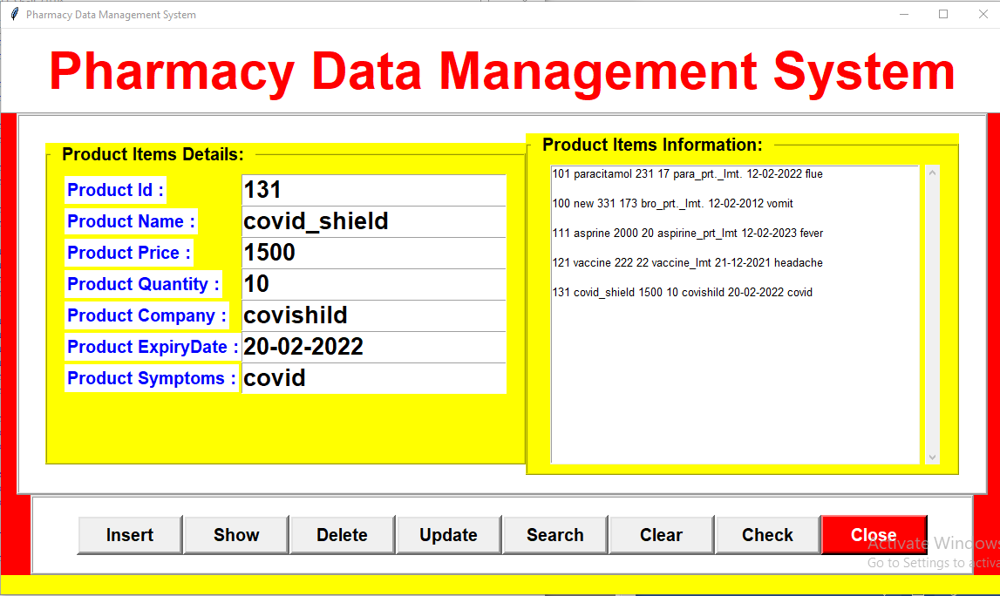

# pharmacy-management-system

## All the Operations available in the app

## Insert

When the user writes the data in left side (Product Items Details Section) and click Insert button then the entries are added in the database and the database entries are shown on the right side box (Product Items Detail Section).

