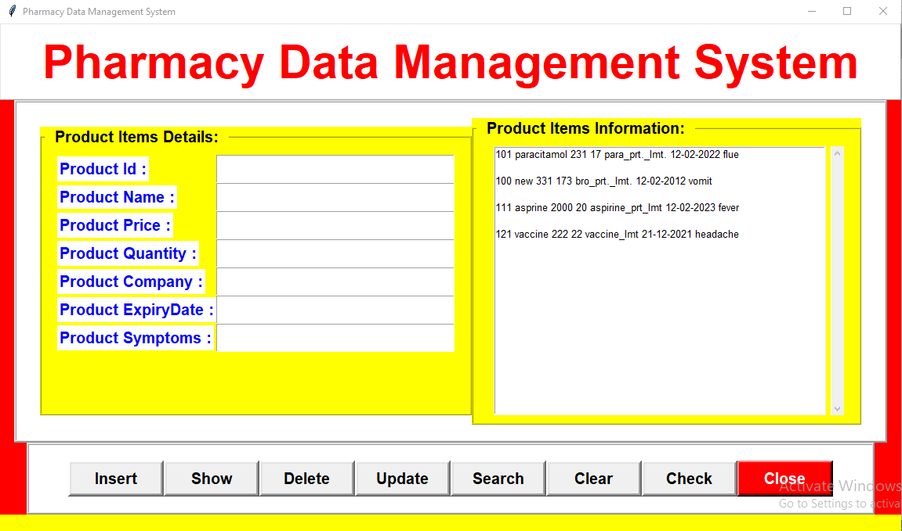
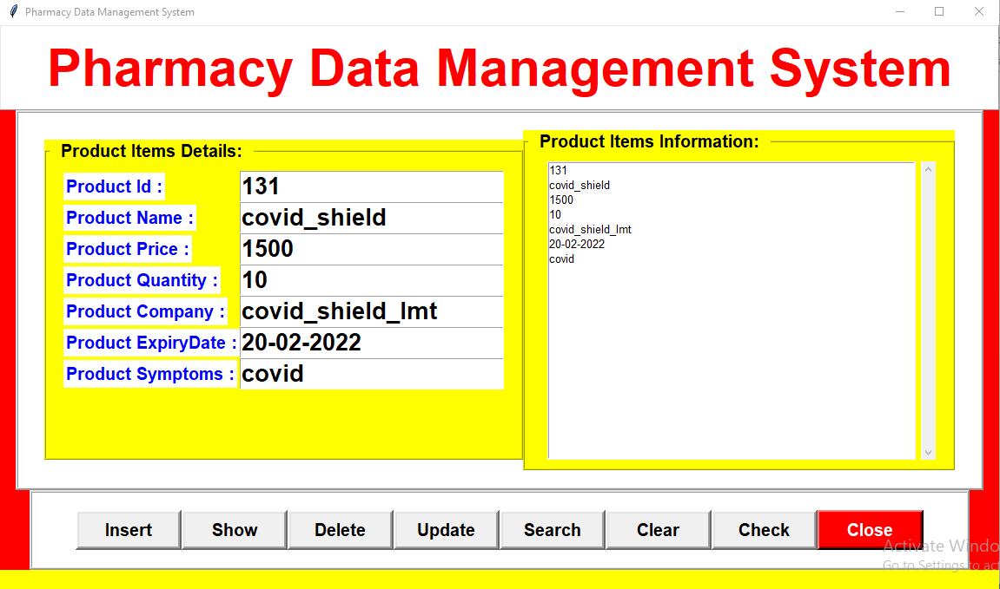
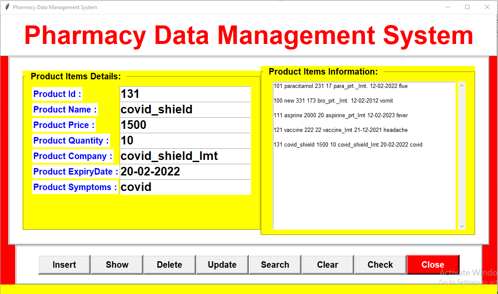
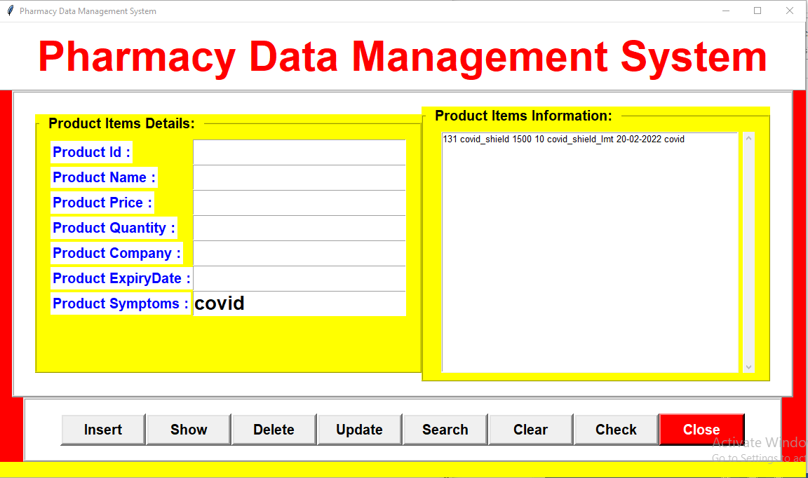
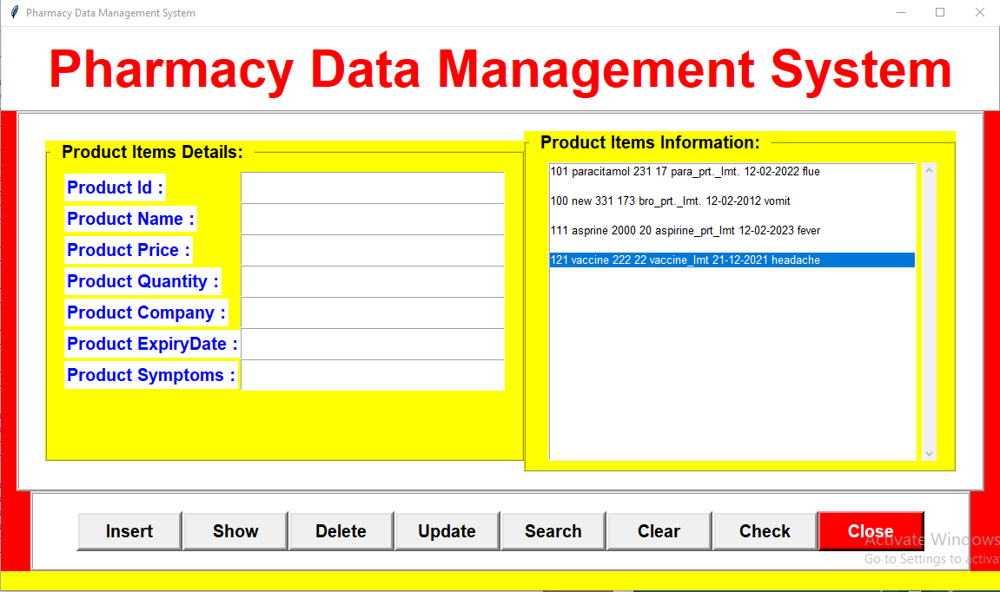
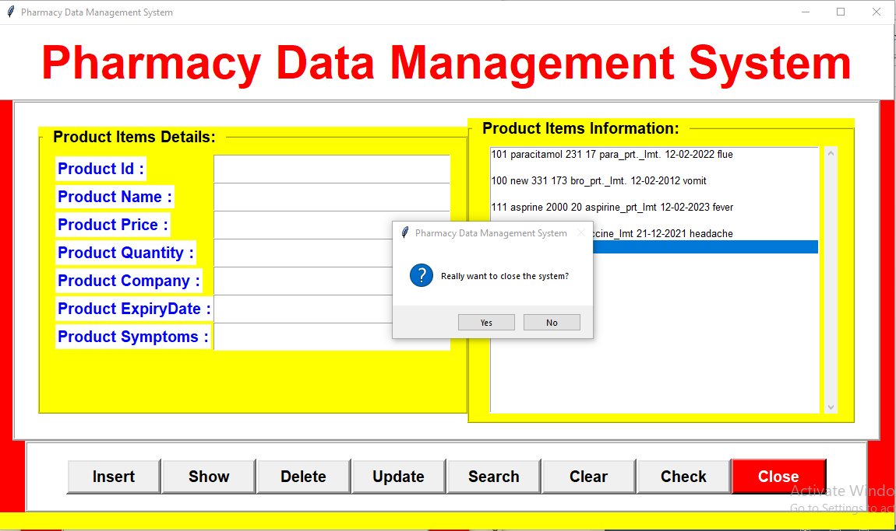
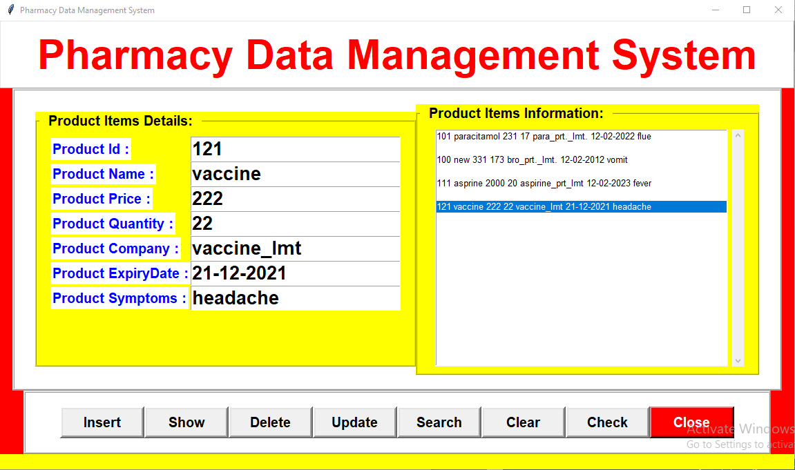
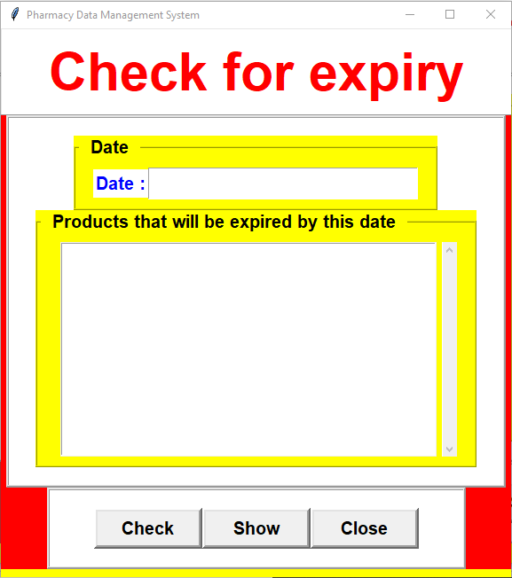

# pharmacy-management-system

## All the Operations available in the app

## Insert

When the user writes the data in left side (Product Items Details Section) and click Insert button then the entries are added in the database and the database entries are shown on the right side box (Product Items Detail Section).

## Show

When the user click on Show button then the database is shown in theright side box (Product Items Detail Section).

## Delete

When the user writes the data(product id is compulsory) and click Delete button then the entries are deleted from the database and the remaining database entries are shown on the right side box (Product Items Detail Section).

## Update

When the user writes the data in left side (Product Items Details Section) and click Insert button then the entries are added in the database and the database entries are shown on the right side box (Product Items Detail Section).

Now the user can click on show to view the whole database.

## Search

When the user writes the data in left side (Product Items Details Section) and click Search button then the entries that matches the data in the database are shown on the right side (Product Items Detail Section).

## Clear

When the user click Clear button then the entries on the right side(Product Items Detail Section) get deleted.

## Close

When the user click Close button then a confirmation message will be shown to close the app.

## Click

When the user click a particular entry from right side (Product Items Detail Section) the values will automatically be filled in left side (Product Items Details Section)

## Check

When the user click Check button the user went to a new page where he can check that till a particular date which all medicine that he has will get expired and according to it he/she can manage his new buying.

